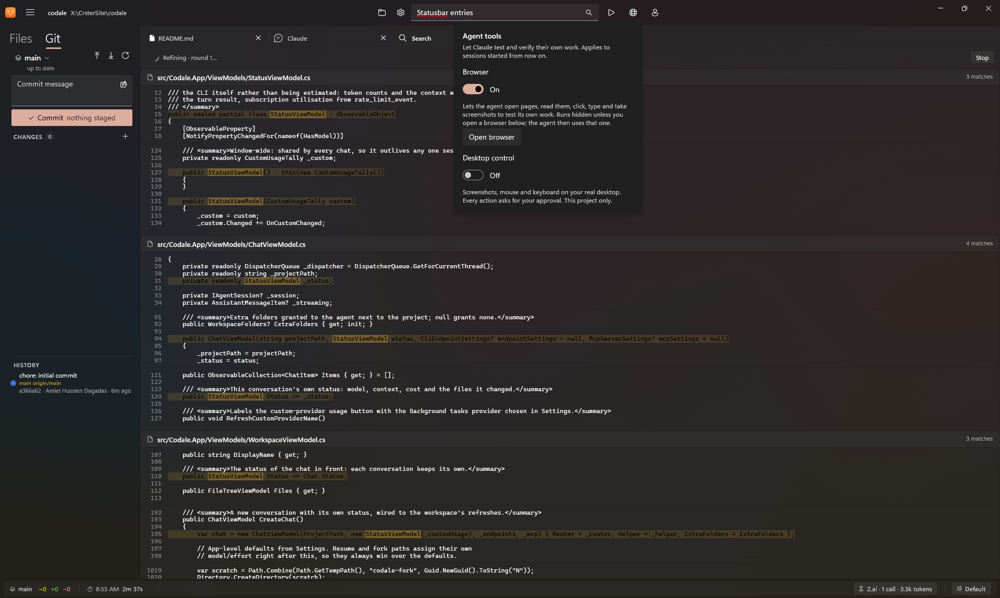
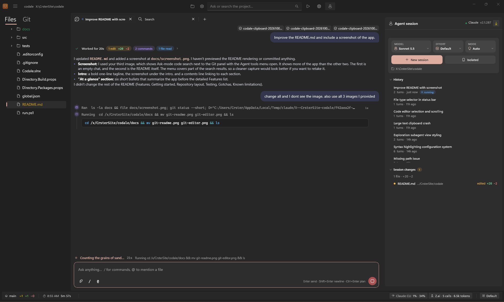
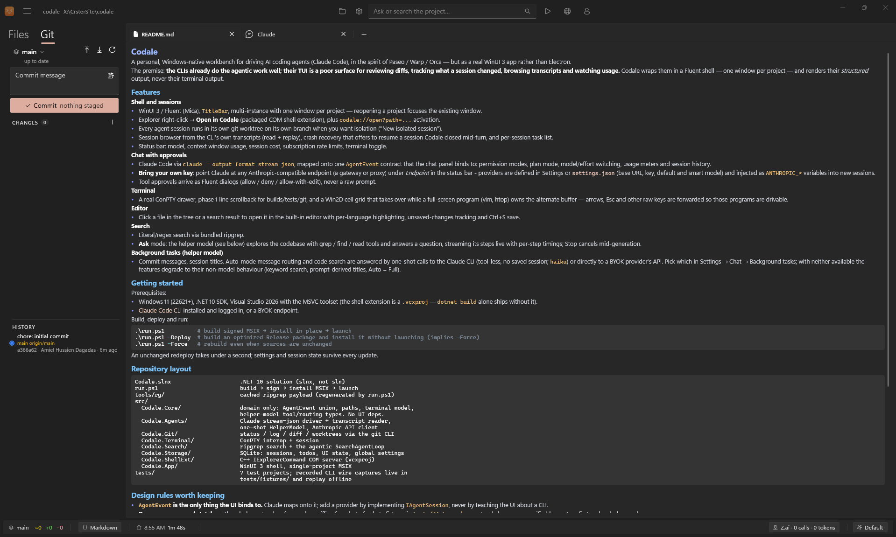

# Codale

**A Windows-native workbench for driving AI coding agents.**

Codale is a WinUI 3 app (not Electron) built around Claude Code, in the spirit of Paseo / Warp / Orca.
The CLIs already do the agentic work well. Their TUI is a poor surface for reviewing diffs,
tracking what a session changed, browsing transcripts and watching usage. Codale wraps them in a
Fluent shell, with one window per project, and renders their *structured* output, never their
terminal output.



## Contents

- [Tour](#tour)
- [Features](#features)
- [Getting started](#getting-started)
- [Repository layout](#repository-layout)
- [Design rules](#design-rules)
- [Testing](#testing)
- [Gotchas](#gotchas)
- [Known limitations](#known-limitations)

## Tour

### Chat with an agent

The chat panel sits beside your files. The session panel on the right sets model, effort and
permission mode, starts a normal or isolated (worktree) session, and lists past sessions you can
read or resume.



### Review changes with git

The Git tab shows status, branch sync, a commit box and history. The built-in editor opens any
file, including Markdown, with highlighting and unsaved-changes tracking.



### Search the way you'd ask

Search is ripgrep underneath. In **Ask** mode a helper model greps, finds and reads files, then
streams its steps live. Agent tools (the browser and desktop control) are one click away.


## Features

**Shell and sessions**
- WinUI 3 / Fluent (Mica) with a `TitleBar`. One window per project, and reopening a project
  focuses the existing window.
- Explorer right-click → **Open in Codale** (packaged COM shell extension), plus
  `codale://open?path=...` activation.
- Optional isolation: each agent session can run in its own git worktree on its own branch
  ("New isolated session").
- Session browser built from the CLI's own transcripts (read and replay), crash recovery that
  offers to resume a session Codale closed mid-turn, and a per-session task list.
- Status bar: model, context window usage, session cost, subscription rate limits, terminal toggle.

**Chat with approvals**
- Claude Code via `claude --output-format stream-json`, mapped onto one `AgentEvent` contract
  that the chat panel binds to. Supports permission modes, plan mode, model and effort switching,
  usage meters and session history.
- **Bring your own key**: point Claude at any Anthropic-compatible endpoint (a gateway or proxy)
  under *Endpoint* in the status bar. Providers are defined in Settings or `settings.json`
  (base URL, key, default and smart model) and injected as `ANTHROPIC_*` variables into new
  sessions.
- Tool approvals arrive as Fluent dialogs (allow / deny / allow-with-edit), never a raw prompt.

**Git**
- Status, log, diff, commit and worktrees through the git CLI. Git is the authority on what
  changed, so the panels stay correct even if you edit by hand.

**Terminal**
- A real ConPTY drawer. Phase 1 is line scrollback for builds, tests and git. A Win2D cell grid
  takes over while a full-screen program (vim, htop) owns the alternate buffer, and arrows, Esc and
  other raw keys are forwarded so those programs are drivable.

**Editor**
- Click a file in the tree or a search result to open it in the built-in editor, with
  per-language highlighting, unsaved-changes tracking and Ctrl+S save.

**Search**
- Literal and regex search via bundled ripgrep.
- **Ask** mode: the helper model (see below) explores the codebase with grep / find / read tools
  and answers a question, streaming its steps live with per-step timings. Stop cancels
  mid-generation.

**Agent tools**
- Optional, per-project switches that let the agent test its own work: a hidden browser it can
  drive, and desktop control where every action asks for your approval.

**Background tasks (helper model)**
- Commit messages, session titles, Auto-mode message routing and code search are answered by
  one-shot calls to the Claude CLI (tool-less, no saved session; `haiku`) or directly to a BYOK
  provider's API. Choose which in Settings → Chat → Background tasks. With neither available, the
  features fall back to non-model behavior: keyword search, prompt-derived titles, Auto = Full.

## Getting started

**Prerequisites**
- Windows 11 (22621+), .NET 10 SDK, and Visual Studio 2026 with the MSVC toolset. The shell
  extension is a `.vcxproj`, so `dotnet build` alone ships without it.
- [Claude Code CLI](https://claude.com/claude-code) installed and logged in, or a BYOK endpoint.

**Build, deploy and run**

```powershell
.\run.ps1          # build signed MSIX → install in place → launch
.\run.ps1 -Deploy  # build an optimized Release package and install it without launching (implies -Force)
.\run.ps1 -Force   # rebuild even when sources are unchanged
```

An unchanged redeploy takes under a second. Settings and session state survive every update.

## Repository layout

```
Codale.slnx                     .NET 10 solution (slnx, not sln)
run.ps1                         build → sign → install MSIX → launch
docs/                           README screenshots
tools/rg/                       cached ripgrep payload (regenerated by run.ps1)
src/
  Codale.Core/                  domain only: AgentEvent union, paths, terminal model,
                                helper-model tool/routing types. No UI deps.
  Codale.Agents/                Claude stream-json driver + transcript reader,
                                one-shot HelperModel, Anthropic API client
  Codale.Git/                   status / log / diff / worktrees via the git CLI
  Codale.Terminal/              ConPTY interop + session
  Codale.Search/                ripgrep search + the agentic SearchAgentLoop
  Codale.Storage/               SQLite: sessions, todos, UI state, global settings
  Codale.ShellExt/              C++ IExplorerCommand COM server (vcxproj)
  Codale.App/                   WinUI 3 shell, single-project MSIX
tests/                          7 test projects; recorded CLI wire captures live in
                                tests/fixtures/ and replay offline
```

## Design rules

- **`AgentEvent` is the only thing the UI binds to.** Claude maps onto it. Add a provider by
  implementing `IAgentSession`, never by teaching the UI about a CLI.
- **Parsers are pure and stateless.** The whole protocol surface replays offline from
  byte-for-byte fixtures in `tests/fixtures/`. Protocol changes are verified by capture first
  and coded second.
- **Unknown protocol messages surface in the UI** as notices and are never silently dropped.
  That is the drift alarm.
- **git is the authority on what changed.** The changes and diff panels read `git diff`.

## Testing

```bash
dotnet test Codale.slnx          # ~200 offline tests, no CLI or tokens needed
```

Tests that spend real compute (a real CLI turn) are opt-in:

```bash
CODALE_LIVE_TESTS=1 dotnet test tests/Codale.Agents.Tests --filter "FullyQualifiedName~Live"
```

Set `CODALE_LIVE_RAW_LOG=<path>` on a live run to capture the wire exchange as a replay fixture.

## Gotchas

- **`--permission-prompt-tool stdio` routes Claude's approvals to the host.** Without it the CLI
  silently denies. The approval reply must also *omit* `updatedInput`, because sending `null` is
  rejected in a way that looks like it worked.
- **The session panel's task list comes from `codale-tasks`' `todos_set`.** The CLI's own
  `TodoWrite` / `TaskCreate` / `TaskUpdate` are switched off with `--disallowedTools` whenever
  that server is attached, so the panel has one source (`TodoParser.FromToolInput` reads
  `todos_set`'s `content` / `status`).
- The WinUI `TitleBar` control owns the caption text. The taskbar and alt-tab title follow
  `AppWindow.Title`, not `Window.Title`.

## Known limitations

- Subagent sidechains are not replayed in session history yet.
